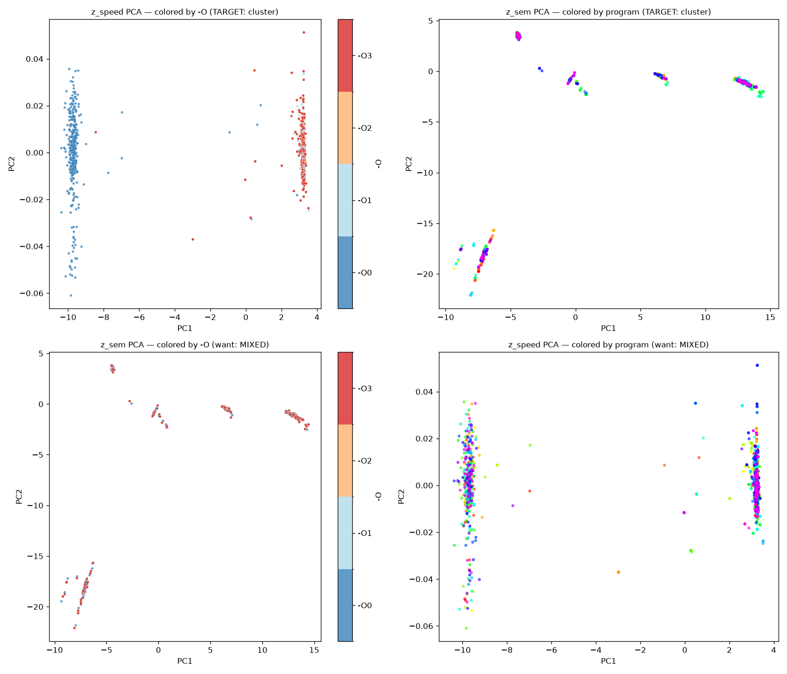

# Results — factored encoder `z = [z_sem | z_speed]`

> Run 2026-06-28 on the pod (B200). Self-supervised, no labels. Train→eval chain:
> `scripts/build_cache.py` → `scripts/train.py` → `scripts/eval_disentangle.py`.

## ⭐ Shipped encoder (corrected loss) — `checkpoints/encoder.pt`

8k ExeBench functions, after the `factored_loss` normalization fix (`docs/loss_review.md`):

| | value |
|---|---|
| z_sem effective rank (of 96) | **72.4** (90% var in 48 dims) |
| z_sem cos gap (intra-program − inter) | **0.895** |
| z_sem silhouette by `-O` (off-target) | **−0.004** ✓ opt-invariant |
| z_speed effective rank (of 32) | 2.64 (1-D signal) |
| z_speed cos gap (intra-level − inter) | 0.518 |
| z_speed silhouette by program (off-target) | **−0.907** ✓ program-invariant |

Disentanglement holds (both off-target silhouettes ≤ 0) and `z_sem` is now high-rank.
`z_speed` is a single honest axis (O0-vs-optimized), bounded by the gate, not the loss.

> The section below documents the **initial** run (3k functions, pre-fix loss). It
> is kept for the before/after contrast: there `z_sem` had effective rank ~3-4 and
> a higher *apparent* `z_speed` gap (0.93) that was a collapse artifact.

---

## Setup

| | |
|---|---|
| Corpus | ExeBench `train_real_compilable`, **encoder** pool, **3000 programs** (train 2165 / val 396 / test 439), `min_nodes=16` |
| Representation | ProgramML graph (bundled clang-10), 3 edge relations (control/data/call), node feature = `text` vocab (**931** tokens) |
| Model | `FactoredEncoder`: 6-layer 3-relation GraphConv trunk → mean‖max pool → 2 heads (`sem_dim=96`, `speed_dim=32`) |
| Loss | VICReg invariance per block (z_sem ↔ same program across -O; z_speed ↔ same -O across programs) + variance/covariance + **cross-decorrelation** z_sem ⟂ z_speed |
| Train | 50 epochs, 64 programs/batch (×4 -O views), Adam lr 1e-3 cosine, ~1650 steps, **~30 s** on B200 |
| Anti-collapse | `sem_std ≈ 1.02`, `speed_std ≈ 0.98` at convergence — **no collapse** |

## Disentanglement (held-out test, 400 programs × 4 views = 1600 embeddings)

| Metric | Value | Reading |
|---|---|---|
| `z_sem` cos **intra-program** (across -O) | **1.000** | the 4 -O views of a program map to the *same* z_sem |
| `z_sem` cos **inter-program** | 0.107 | different programs separated |
| **z_sem gap** | **0.893** | strong: z_sem = program identity, invariant to -O |
| `z_speed` cos **intra-level** (across programs) | **0.924** | same -O across programs → same z_speed |
| `z_speed` cos **inter-level** | −0.010 | different -O separated |
| **z_speed gap** | **0.934** | strong: z_speed = optimization profile, invariant to program |
| silhouette `z_speed` by **-O** (on-target) | **+0.219** | clusters by opt level |
| silhouette `z_speed` by **program** (off-target) | **−0.933** | ignores program → disentangled |
| silhouette `z_sem` by **program** (on-target) | +0.034 | positive (harsh: 400 tiny clusters in 2-D) |
| silhouette `z_sem` by **-O** (off-target) | **−0.003** | ignores opt level → disentangled |
| PCA explained var `z_speed` | **[1.00, 0.00]** | z_speed is **one-dimensional** |
| PCA explained var `z_sem` | [0.58, 0.40] | spread across program structure |

Colors: `-O` is a discrete blue→red ramp (**-O0 = blue … -O3 = red**); programs use
a high-variety rainbow map.

- **top-left** `z_speed` by -O: two groups along PC1 — **blue (O0)** on the left vs
  **red/orange ({O1,O2,O3})** on the right = the single optimization axis.
- **top-right** `z_sem` by program: tight per-program clusters.
- **bottom-left** `z_sem` by -O: inside each program cluster the blue and red points
  overlap → the 4 -O views collapse together = **invariant to optimization**.
- **bottom-right** `z_speed` by program: rainbow colors fully mixed = **invariant to
  program**.

## Interpretation

The factorization works: **z_sem carries *what the code does*** (invariant to the -O
level), **z_speed carries *the optimization profile*** (invariant to the program),
and the two are decorrelated (cross term → 0, off-target silhouettes ≤ 0).

**z_speed is one-dimensional, and that is the honest answer to the Step-1 gate.**
The gate (`results_gate_exebench.md`) measured that on isolated functions the only
robustly separable optimization axis is **O0 vs optimized** (O0≠O1 100%, but O2≈O3
identical). The encoder, trained with a 4-class speed objective, *discovered* exactly
that: it places O0 at one end of a single axis and collapses {O1,O2,O3} at the other.
No supervision told it to — it's the structure the data actually contains.

### Caveats (honest)

- `z_sem` intra-program cos = 1.000 is partly inflated because O1/O2/O3 graphs are
  often *identical inputs* (gate result), so 3 of the 4 views are trivially equal;
  the real work is making O0's z_sem match the rest — which it does.
- Distinguishing O1/O2/O3 inside `z_speed` would need a **whole-program** corpus
  (cbench/MiBench/SPEC) where -O3 has inlining/vectorization to do. With ExeBench
  isolated functions, a 1-D speed axis is the ceiling — and the encoder reaches it.
- To make the O1-vs-O2 boundary sharper, bias the cache to larger functions
  (`--min-nodes` higher); the gate showed O1≠O2 rises to ~46% above 100 nodes.
